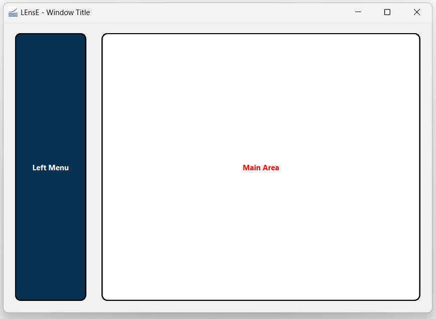

GUI1 Example
============

In this first example of GUI, we will learn the basics of the development of a graphical interface, based on PyQt6.

At the end of this example, you will be able to create this skeleton of graphical application.

|

The complete file :file:`Gui01.py` of this example is in the :file:`interface/` directory.

|

MainWindow and main function
----------------------------

As mentionned in the :ref:`pyqt6-basics-page` page, graphical applications with Qt are based on containers and contents to include as graphical objects.

The main container of a window application is a **QMainWindow** object from Qt. 

*It could also be a* :code:`QWidget` *object, but this case will not be processed in this tutorial.*

Creation of a main window
~~~~~~~~~~~~~~~~~~~~~~~~~

To create the main block of your final application, you have to develop a class inherited from the **QMainWindow** object of the *QtWidgets* sub-library of the **PyQt6** API.

Copy this few lines in a :file:`*.py` file (:file:`my_app.py` for example).

.. code-block:: python
  :linenos:

  from PyQt6.QtWidgets import QMainWindow
  
  class MainWindow(QMainWindow):
	def __init__(self):
      super().__init__()

To initialize this graphical main window, the initialization function of the mother class (**QMainWindow** class) is called.

This example code does not produce a windowed application because no :code:`MainWindow` object is instantiated.

Creation of the main function
~~~~~~~~~~~~~~~~~~~~~~~~~~~~~

To vizualize the result of the previous code, the main function has to instantiate a :code:`MainWindow` object and to execute the application, via the **QApplication** class.

Complete the previous :file:`my_app.py` file by these new lines.

.. code-block:: python
  :linenos:
  
  from PyQt6.QtWidgets import QApplication

  if __name__ == "__main__":
	app = QApplication(sys.argv)
	window = MainWindow()
	window.show()
	sys.exit(app.exec())
	
The execution of this code give the previous showed in the next figure.
 
.. image:: ../_static/gui1_step_1.png
   :alt: Gui1 - Main Window Application
   :align: center
   

Title, icon and size of the application
---------------------------------------

Applications often have title and mostly icon that appear in the title bar (the top bar of the application window).

In the :code:`__init__` function of the **MainWindow** class, you can :

- specify a title by the :code:`setWindowTitle` method of the **QMainWindow** class, 
- add an icon to your application via a **QIcon** object from the *QtGui* sub-library of the **PyQt6** API and the :code:`setWindowIcon` method of the **QMainWindow** class

You can also specify the size and the position of your windowed application by using the :code:`setGeometry` method of the **QMainWindow** class. This method takes 4 parameters : 

- x position of the top-left corner of your application (horizontal position),
- y position of the top-left corner of your application (vertical position),
- width of the window (horizontal size),
- height of the window (vertical size)

.. code-block:: python
  :linenos:
  
  from PyQt6.QtGui import QIcon
  
  class MainWindow(QMainWindow):
	def __init__(self):
      super().__init__()

      # Define Window title
      self.setWindowTitle("LEnsE - Window Title")
      self.setWindowIcon(QIcon('images/IOGS-LEnsE-logo.jpg'))
      self.setGeometry(50, 50, 1000, 700)

First graphical container and object
------------------------------------

To add 

Separated classes for containers
--------------------------------

In order to not overload the code and to make the debugging process easier, you can create a specific class for each main part of your application, especially for containers. All the containers of your main application will inherite from the :code:`QWidget` class.

