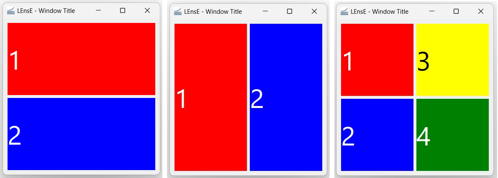
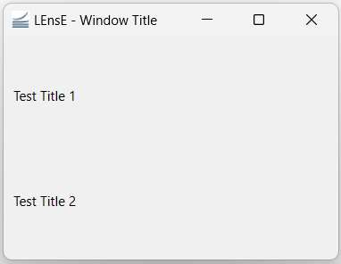
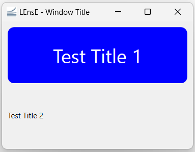

GUI1 Example
============

In this first example of GUI, we will learn the basics of the development of a graphical interface, based on PyQt6.

At the end of this example, you will be able to create this skeleton of graphical application.

.. image:: ../_static/gui1_view.png
   :alt: Gui1 Example View
   :scale: 50%
   :align: center

|

The complete file :file:`Gui01.py` of this example is in the :file:`interface/` directory.

|

MainWindow and main function
----------------------------

As mentionned in the :ref:`pyqt6-basics-page` page, graphical applications with Qt are based on containers and contents to include as graphical objects.

The main container of a window application is a **QMainWindow** object from Qt. 

*It could also be a* :code:`QWidget` *object, but this case will not be processed in this tutorial.*

Creation of a main window
~~~~~~~~~~~~~~~~~~~~~~~~~

To create the main block of your final application, you have to develop a class inherited from the **QMainWindow** object of the *QtWidgets* sub-library of the **PyQt6** API.

Copy this few lines in a :file:`*.py` file (:file:`my_app.py` for example).

.. code-block:: python
  :linenos:

  from PyQt6.QtWidgets import QMainWindow
  
  class MainWindow(QMainWindow):
    def __init__(self):
      super().__init__()

To initialize this graphical main window, the initialization function of the mother class (**QMainWindow** class) is called.

This example code does not produce a windowed application because no :code:`MainWindow` object is instantiated.

Creation of the main function
~~~~~~~~~~~~~~~~~~~~~~~~~~~~~

To vizualize the result of the previous code, the main function has to instantiate a :code:`MainWindow` object and to execute the application, via the **QApplication** class.

Complete the previous :file:`my_app.py` file by these new lines.

.. code-block:: python
  :linenos:
  
  from PyQt6.QtWidgets import QApplication

  if __name__ == "__main__":
    app = QApplication(sys.argv)
    window = MainWindow()
    window.show()
    sys.exit(app.exec())
	
The execution of this code give the previous showed in the next figure.
 
.. image:: ../_static/gui1_step_1.png
   :alt: Gui1 - Main Window Application
   :align: center
   

Title, icon and size of the application
---------------------------------------

Applications often have title and mostly icon that appear in the title bar (the top bar of the application window).

In the :code:`__init__` function of the **MainWindow** class, you can :

- specify a title by the :code:`setWindowTitle` method of the **QMainWindow** class, 
- add an icon to your application via a **QIcon** object from the *QtGui* sub-library of the **PyQt6** API and the :code:`setWindowIcon` method of the **QMainWindow** class

You can also specify the size and the position of your windowed application by using the :code:`setGeometry` method of the **QMainWindow** class. This method takes 4 parameters : 

- x position of the top-left corner of your application (horizontal position),
- y position of the top-left corner of your application (vertical position),
- width of the window (horizontal size),
- height of the window (vertical size)

.. code-block:: python
  :linenos:
  
  from PyQt6.QtGui import QIcon
  
  class MainWindow(QMainWindow):
    def __init__(self):
      super().__init__()

      # Define Window title
      self.setWindowTitle("LEnsE - Window Title")
      self.setWindowIcon(QIcon('images/IOGS-LEnsE-logo.jpg'))
      self.setGeometry(50, 50, 1000, 700)
	  
About oriented object programming
~~~~~~~~~~~~~~~~~~~~~~~~~~~~~~~~~

In the previous example, all the methods used to improve the graphical interface (set a title or an icon...) refered to an object called **self**.

This object refered to the instantiation of itself, meaning that you want to perform actions contained in the different methods on the object itself.

In the next sections, you will see that it's also possible to create specific attribute to an object by adding the term **self** behind the name of the attribute. For example, :code:`self.title` corresponds to the attribute called *title* of the object. Each instantiation of an object where this attribute is initialized has its own *title*.

All the internal methods of a class can access to this specific attribute by using :code:`self.title`.

First graphical container and object
------------------------------------

The **QMainWindow** object is a container that can receive other graphical containers or objects. 

Especially, it's possible to add a graphical container (a **QWidget** object for example) in its central area.

Main window central container
~~~~~~~~~~~~~~~~~~~~~~~~~~~~~

In the :code:`__init__` function of the **MainWindow** class, you can create a **QWidget** object, called *main_widget*. This widget is then set as the central widget of the **QMainWindow** object.

.. code-block:: python
  :linenos:
  
  from PyQt6.QtWidgets import QWidget
  
  class MainWindow(QMainWindow):
    def __init__(self):
      super().__init__()
	  [...]
		
      # Main Layout
      self.main_widget = QWidget()
      self.setCentralWidget(self.main_widget)

If you run the :file:`*.py` file, nothing really changed before the previous test. The main issue is that the background color by default of a **QWidget** object is the same as the background color of the window itself.

You can change the background by adding this line in the :code:`__init__` function of the **MainWindow** class : :code:`self.main_widget.setStyleSheet("background-color: red;")`.

Layout of the window
~~~~~~~~~~~~~~~~~~~~

Before adding graphical objects (as labels or buttons...), you need to specify to the container that will receive those objects how to place them in relation to each other. This behavior is setup by specific objects called **layouts**.

There are different types of layout in Qt. The main ones are : 

- vertical layout (**QVBoxLayout**) that lines up widgets vertically
- horizontal layout (**QHBoxLayout**) that lines up widgets horizontally
- grid layout (**QGridLayout**) that lays out widgets in a grid

   
   Vertical, Horizontal and Grid layout examples.

|

To set a specific layout to a widget, you can use the :code:`setLayout` method of the **QWidget** class.

.. code-block:: python
  :linenos:
  
  from PyQt6.QtWidgets import QVBoxLayout
  
  class MainWindow(QMainWindow):
    def __init__(self):
      super().__init__()
	  [...]
		
      # Main Layout
      self.main_widget = QWidget()
	  [...]
		
	  self.main_widget_layout = QVBoxLayout()
	  self.main_widget.setLayout(self.main_widget_layout)

First label
~~~~~~~~~~~

We can now include graphical objects in our windowed application !

The first graphical object we can try is the **QLabel** object that allows to write text. After instantiated a **QLabel** object, we have to add it to an existing layout by the :code:`addWidget` method of the layout class.

In the case of a **QVBoxLayout** or a **QHBoxLayout** layout, the graphical object is positionned to the next vertical or horizontal place in the layout. In the case of a **QGridLayout** layout, you also need to specify the horizontal line and the vertical row where you want to place the graphical object (*see example in the next section*).

.. code-block:: python
  :linenos:
  
  from PyQt6.QtWidgets import QLabel
  
  class MainWindow(QMainWindow):
    def __init__(self):
      super().__init__()
	  [...]
	  self.title_label = QLabel('Test title')	  
	  self.main_widget_layout.addWidget(self.title_label)

.. image:: ../_static/gui1_step_3.png
   :alt: Gui1 - First label in our window
   :scale: 60%
   :align: center

|

We can add a second area of text in our vertical layout.

.. code-block:: python
  :linenos:
  
  class MainWindow(QMainWindow):
    def __init__(self):
	  [...]
      self.title_label = QLabel('Test Title 1')
      self.layout.addWidget(self.title_label)
      self.title_label2 = QLabel('Test Title 2')
      self.layout.addWidget(self.title_label2)

Here is the result :

|

CSS decorations and alignment
~~~~~~~~~~~~~~~~~~~~~~~~~~~~~

Qt graphical elements are mostly based on **HTML and CSS rendering**. It's possible to add CSS properties to lots of Qt objects as **QLabel** by using the :code:`setStyleSheet` method of the graphical object class.

You can also align text and objects by using the :code:`setAlignment` method of the graphical object class. This method is based on Qt.AlignmentFlag objects contained in the *QtCore* sub-library of **PyQt6**.

.. code-block:: python
  :linenos:
  
  from PyQt6.QtCore import Qt
  
  class MainWindow(QMainWindow):
    def __init__(self):
      [...]
	  
	  self.title_label.setStyleSheet("background-color: blue; border-radius: 10px; color:white; font-size:30px;")
      self.title_label.setAlignment(Qt.AlignmentFlag.AlignCenter)

The result of the code above is given in the next figure.

|

Separated classes for containers
--------------------------------

In order to not overload the code and to make the debugging process easier, you can create a specific class for each main part of your application, especially for containers. All the containers of your main application inherite from the :code:`QWidget` class.

SimpleWidget class
~~~~~~~~~~~~~~~~~~

In the next exemple, a :code:`SimpleWidget` class was defined in a file called :file:`SimpleWidget.py` stored in the directory called :file:`elements` of the :file:`interface` directory (where the :file:`Gui1.py` is stored).

You can find the documentation of this :code:`SimpleWidget` class by following this link :

.. toctree::
   :maxdepth: 1
   
   elements/simpleWidget
   
This class inherites from the :code:`QWidget` class, a container of Qt application. In the initialization function of this new class, the constructor (:code:`__init__` function) of the mother class is called (mother class is the :code:`QWidget` class).

.. code-block:: python
  :linenos:
  
  class SimpleWidget(QWidget):
    def __init__(self, title='', background_color='#0A3250', text_color='#FFFFFF'):
      """
      Initialisation of the widget.
      """
      super().__init__(parent=None)

Few parameters permit to customize the rendering of the graphical object : a title - a text displays in the main area of the widget, the background color and the color of the text. These three parameters are optionnal, and the default value are mentionned in the :code:`__init__` function parameters.

.. code-block:: python
  :linenos:
  
  class SimpleWidget(QWidget):
    def __init__(...):
      [...]
	  self.title = title
      self.background_color = background_color
      self.text_color = text_color
	  
These parameters are attributes of the class (:code:`self`). They could be changed independently for each instance of a :code:`SimpleWidget` object.

Layout of the SimpleWidget class
""""""""""""""""""""""""""""""""

Test

Graphical objects of the SimpleWidget class
"""""""""""""""""""""""""""""""""""""""""""

.. seealso::

   .. py:class:: SimpleWidget()
      :noindex:

	  Documentation of the <elements/simpleWidget> module.

Main application
~~~~~~~~~~~~~~~~
