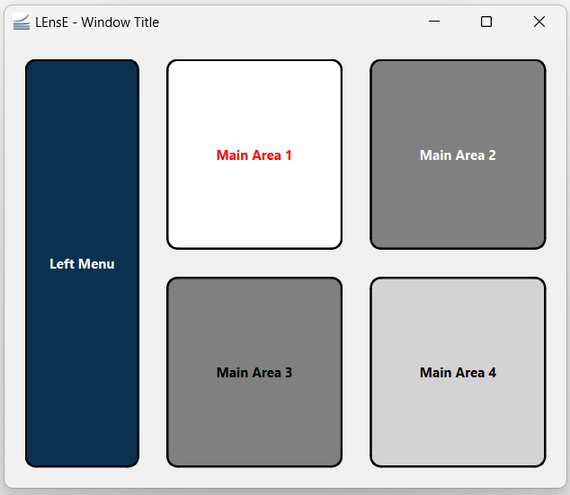

GUI2 Example
============

In this second example of GUI, we will learn ...

At the end of this example, you will be able to create this skeleton of graphical application.

|

The complete file :file:`Gui02.py` of this example is in the :file:`interface/` directory.

|
